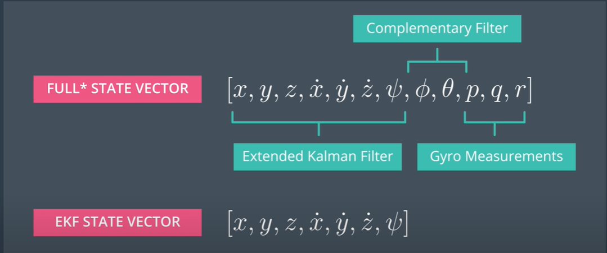
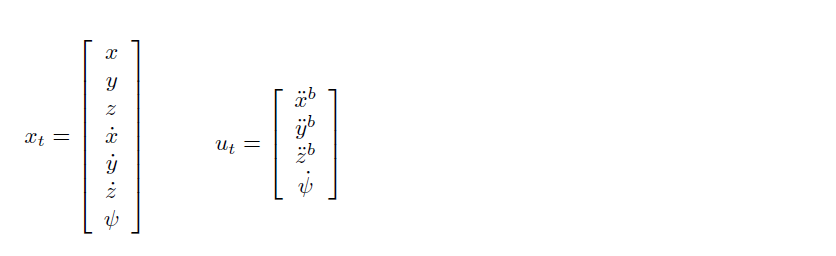
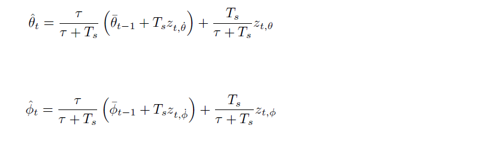
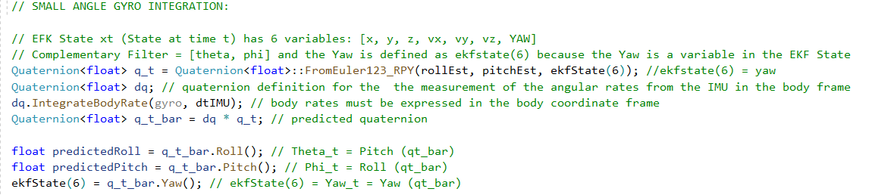
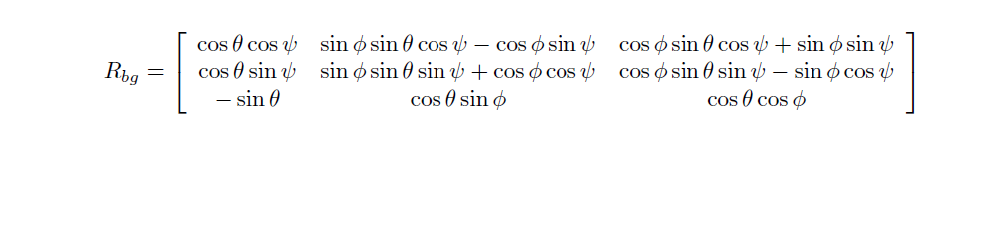
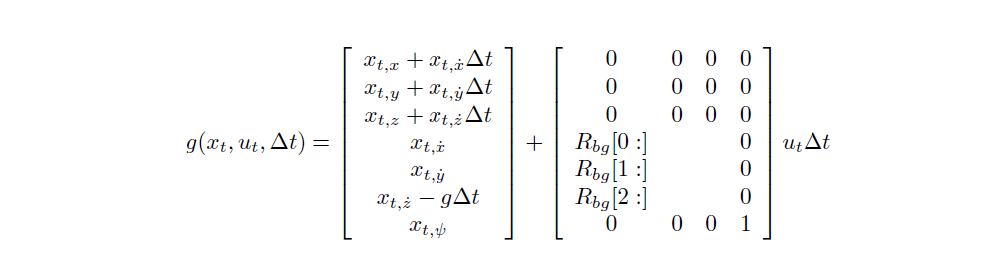
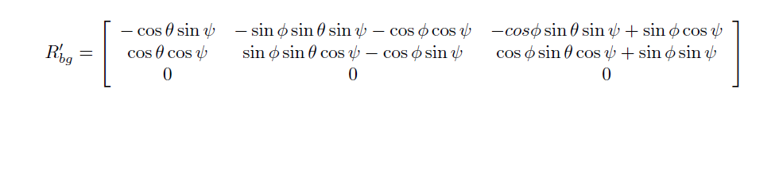
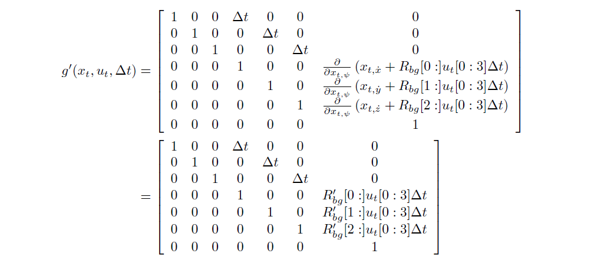
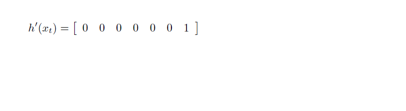
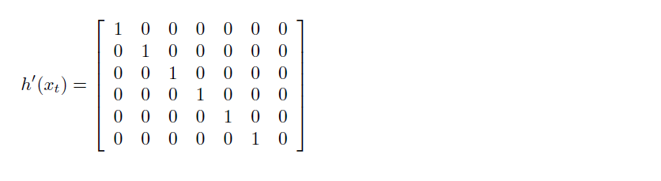

## State Estimation of a 3D Quad with the use of Bayes Rules (Extended Kalman Filter)
 
---------------------
### Final Results
The target of this project is to implement an estimator for a three dimensional quad. 

The role of the estimator is to estimate the state of the vehicle in a real stochastic world with the integration of data (from noisy
but complementary sensors) over the time.

<p align="center">

</p> 

----------------------------------------------------
### Vocabulary and assumption

- Estimation : temporal process with the integration of things over the time. 
	       This process manages the uncertainty and the used of Bayes Rule as a method to integrate data over time.
	
- Bayes Rules : method to take multiple sources of information, and coming up with the distribution that is the best reflection of what 		
		the state might be. 
		The target is always to make a very tight distribution of the state of the drone.

- Real flight vehicle : in reality, we never know the vehicle state with certainty in the real world. That why, the state of a drone 			must be very good estimate. 

------------------------------------------------------
### Tradeoff / Concept strategy  

#### Tradeoff - State Vector
The full state vector has 12 variables as described in the picture below.

You can find :

- the complementary filter for attitude (2 variables),

- the gyro measurements for the body rates (3 variables),

- EKF for position, the velocity and the yaw (7 variables).

In this case, the Jacobian Matrix will be 7*7. 

The Theta and the Phi are implemented in an other complementary filter to avoid a big Jacobian Matrix and difficulties to debug. 
	
<p align="center">

</p> 

#### Tradeoff - Control
For the control , the collective thrust and the 3 moments are not used. 

Instead, the use of X,Y,Z accelerations and the yaw rate for the control input.

This 4 measurements comes directly from the IMU Measurements : 
	
- the three accelerations comes from the accelerometer on the IMU,
	
- the yaw rate comes from the rate gyroscope.

In reality, the IMU is used as control input, because the measurements made by the IMU reflects more the reality as the standard control command (collective thrust + 3 Moments).

As the IMU measures directly these accelerations and accelerations are in some sense what we control when the drone moves, we can justify the use of IMU as control input.

If the IMU is used as measurement and the commanded controls as the control input, the state vector and the Jacobian will be more complex and bigger. 

<p align="center">

</p> 

-------------------------------------------------------
### SW Pipeline

 - Step-1: Sensor noise
 - Step-2: Attitude estimation
 - Step-3: Prediction step
 - Step 4: Magnetometer Update
 - Step 5: Closed Loop + GPS Update
 - Step 6: Adding Your Controller

-------------------------------------------------------
#### Sensor Noise
The GPS and accelerometers data are provided.  

The target is to calculate the noise standard deviation of the provided data over a couple of seconds (between 9 and 10 seconds)
 - 10 Hz for the GPS,
 - 10 kHz for the accelerometer.

The requirement defines a standard deviation with a sufficient capture of the GPS and accelerometers measurements.

The data results graph1.txt and graph2.txt are exported in two csv files for the mean and covariance calculation (standard macro excel).

In this excel file, the mean and the standard deviation are calculated with very simple excel macro and are located in config/log/Graph1.pdf and config/log/Graph2.pdf. 

Finally, the two calculated standard deviation (for the GPS and and for the Accelerater) will be implemented in the configuration file config/6 Sensornoise.txt.
  		
<p align="center">

</p> 

---------------------------------------------------------
#### Attitude Estimation
Part 1 :  Linear complementary filter part (Roll and Pitch) 

The Yaw is not estimated because we will use the magnetometer and do it in the GPS.

The first part of the equation is a high pass filter (for the estimation with a risk of drift in the time (gyro)) and the second part is a low pass filter (for the noisy estimation (accelerometer));

<p align="center">

</p> 


Part 2 :  Nonlinear complementary filter part (Roll and Pitch)
 	- Use of the state to define a quaternion qt for the Euler angle,
	- Definition of qt to be a quaternion for the measurement of the angular rates from the IMU in the body frame.		
<p align="center">

</p> 


The video shows the results of the attitude estimation in the time :
<p align="center">

</p> 

------------------------------------------------------------
#### Prediction Model (EKF)

The prediction Step (EKF) is an implementation of the transition function g with his Jacobian g' for the non local linearity.

The Rgb rotation defines a rotation from the body frame to the global frame. 

She is useful in the transition function g and the Rgb' is useful in the Jacobian g'.

You can find the equations for th implementation. 
<p align="center">

</p> 

<p align="center">

</p> 

<p align="center">

</p> 

<p align="center">

</p> 

--------------------------------------------------------------
#### Measurement Model (EKF) with Controller

As the IMU is use as control input, it's not useful to provide measurement model for the IMU.

--------------------------------------------------------------
##### Measurement Model (EKF) : Magnetometer Update (EKF) with Controller
The Reading from the magnetometer reporting yaw is in the global frame.

This measurement may need be computed using roll and pitch from the complementary attitude filter and the mag vector.

The jocobian h' is a matrix of 1 and 0.

<p align="center">

</p> 

The results are :
<p align="center">

</p> 

-----------------------------------------------------------------
##### Measurement Model : Closed Loop + GPS Update (EKF) with Controller 
Position and Velocity comes from the GPS. The heading from the GPS is not present in the measurement model h.

The Jacobian h' is the identity matrix, augmented with a vector of zeros.

<p align="center">

</p> 

---------------------------------------------------------------
### Installation

#### Setup

This project will continue to use the C++ development environment you set up in the Controls C++ project.

 1. Clone the repository
 ```
 git clone https://github.com/udacity/FCND-Estimation-CPP.git
 ```

 2. Import the code into your IDE like done in the [Controls C++ project](https://github.com/udacity/FCND-Controls-CPP#development-environment-setup)
 
 3. You should now be able to compile and run the estimation simulator just as you did in the controls project


#### Project Structure

For this project, you will be interacting with a few more files than before.

 - The EKF is already partially implemented for you in `QuadEstimatorEKF.cpp`

 - Parameters for tuning the EKF are in the parameter file `QuadEstimatorEKF.txt`

 - When you turn on various sensors (the scenarios configure them, e.g. `Quad.Sensors += SimIMU, SimMag, SimGPS`), additional sensor plots will become available to see what the simulated sensors measure.

 - The EKF implementation exposes both the estimated state and a number of additional variables. In particular:

   - `Quad.Est.E.X` is the error in estimated X position from true value.  More generally, the variables in `<vehicle>.Est.E.*` are relative errors, though some are combined errors (e.g. MaxEuler).

   - `Quad.Est.S.X` is the estimated standard deviation of the X state (that is, the square root of the appropriate diagonal variable in the covariance matrix). More generally, the variables in `<vehicle>.Est.S.*` are standard deviations calculated from the estimator state covariance matrix.

   - `Quad.Est.D` contains miscellaneous additional debug variables useful in diagnosing the filter. You may or might not find these useful but they were helpful to us in verifying the filter and may give you some ideas if you hit a block.


#### `config` Directory 

In the `config` directory, in addition to finding the configuration files for your controller and your estimator, you will also see configuration files for each of the simulations.  For this project, you will be working with simulations 06 through 11 and you may find it insightful to take a look at the configuration for the simulation.

As an example, if we look through the configuration file for scenario 07, we see the following parameters controlling the sensor:

```
# Sensors
Quad.Sensors = SimIMU
# use a perfect IMU
SimIMU.AccelStd = 0,0,0
SimIMU.GyroStd = 0,0,0
```

#### Authors 

Thanks to Fotokite for the initial development of the project code and simulator.
